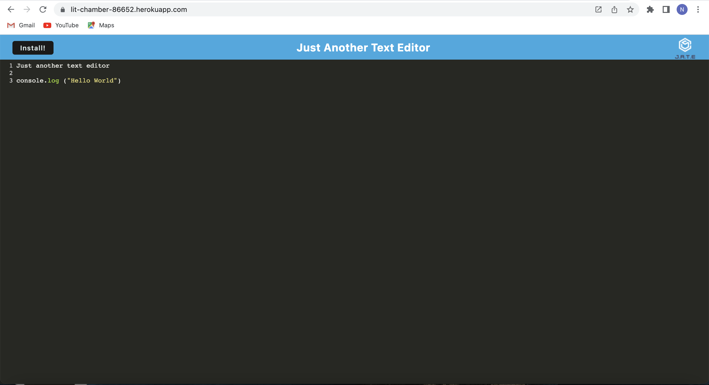
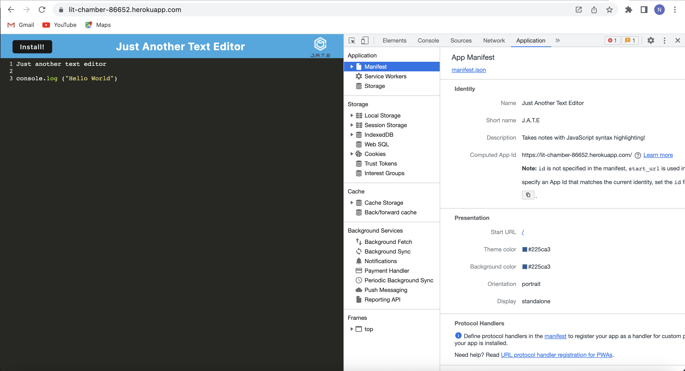
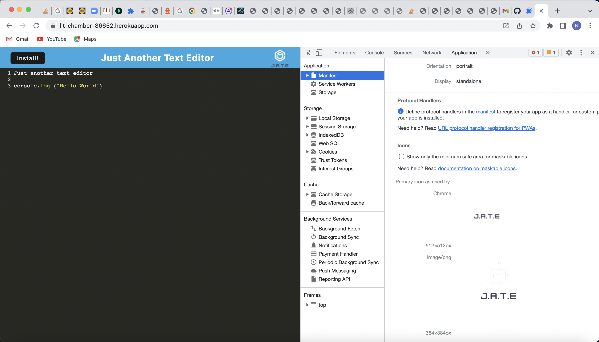
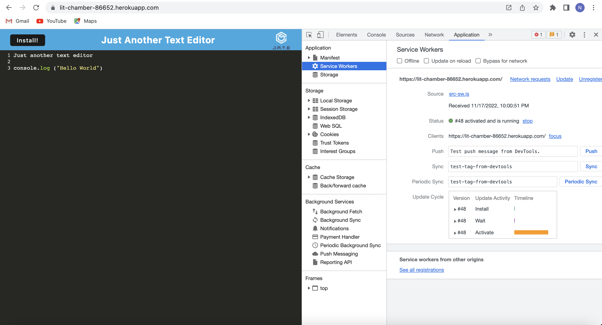
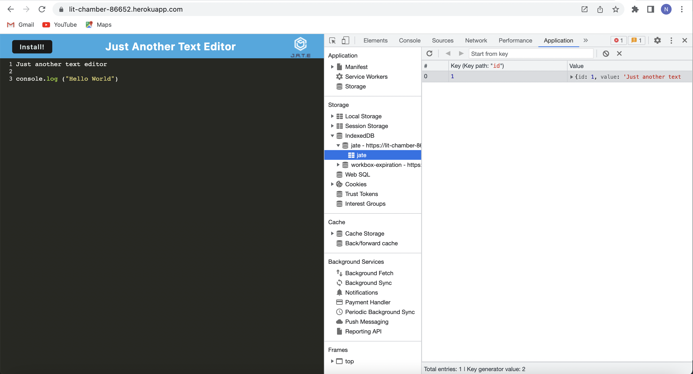

# 19 Progressive Web Applications (PWA): Text Editor

## User Story

```md
AS A developer
I WANT to create notes or code snippets with or without an internet connection
SO THAT I can reliably retrieve them for later use
```

## Description

In this assignment, I have developed a text editor that runs in the browser. The app is a single-page application that meets the PWA criteria. Additionally, it features a number of data persistence techniques that serve as redundancy in case one of the options is not supported by the browser. The application also functions offline.

- Given a text editor web application, when I open my application in my editor then I should see a client server folder structure.
- When I run `npm run start` from the root directory, then I find that my application should start up the backend and serve the client.
- When I run the text editor application from my terminal, then I find that my JavaScript files have been bundled using webpack.
- When I run my webpack plugins, then I find that I have a generated HTML file, service worker, and a manifest file.
- When I use next-gen JavaScript in my application, then I find that the text editor still functions in the browser without errors.
- When I open the text editor, then I find that IndexedDB has immediately created a database storage.
- When I enter content and subsequently click off of the DOM window, then I find that the content in the text editor has been saved with IndexedDB.
- When I reopen the text editor after closing it, then I find that the content in the text editor has been retrieved from our IndexedDB.
- When I click on the Install button, then I download my web application as an icon on my desktop.
- When I load my web application, then I should have a registered service worker using workbox.
- When I register a service worker, then I should have my static assets pre cached upon loading along with subsequent pages and static assets.
- When I deploy to Heroku, then I should have proper build scripts for a webpack application.

## Installation Instructions:

In order to run the app, we need to run the following commands:

- npm i - This will install the node modules.
- npm run build 
- npm run start:dev 

The app is deployed to Heroku. The heroku link is https://lit-chamber-86652.herokuapp.com/

Screenshots:








